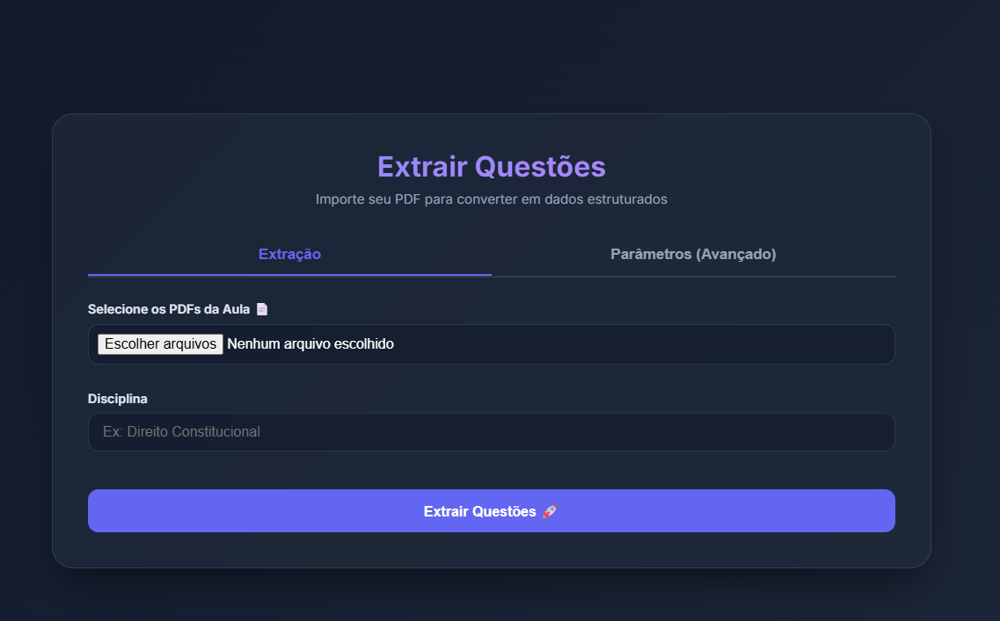

# PDFQuestions2Anki

PDFQuestions2Anki é uma ferramenta web desenvolvida para extrair automaticamente questões de provas e simulados em formato PDF, convertendo-as em recortes de imagens precisos e gerando um arquivo CSV estruturado pronto para o Anki. Ideal para professores, concurseiros e criadores de conteúdo que precisam digitalizar e organizar um banco de questões rapidamente.

<p align="center">
  
</p>

## Funcionalidades
- **Extração**: Lê arquivos PDF com questões (enunciado e resposta) e identifica os limites de cada questão de maneira inteligente.
- **Identificação de Áreas**: Detecta automaticamente as regiões de **Enunciado** e **Resposta** dentro da imagem, permitindo aplicações como efeitos de blur ou ocultação de gabaritos.
- **IDs Únicos Universais (UUID)**: Cada questão recebe um identificador único de 8 caracteres, garantindo que não haja colisões mesmo entre diferentes disciplinas ou sessões.
- **Processamento em Memória Segura (Windows)**: Arquitetura desenhada estruturalmente para evitar problemas de travamento e leitura ("read of closed file").
- **Streaming em Tempo Real (NDJSON)**: Acompanhe o progresso do recorte e veja cada imagem aparecer na tela enquanto o servidor trabalha no backend.
- **Parâmetros Customizáveis**: Ajuste o tamanho da margem do cabeçalho e rodapé diretamente na interface.
- **Organização Automática**: As imagens e o arquivo CSV consolidado (`cards.csv`) são organizados por disciplina na pasta `anki_import/`. As imagens ficam dentro de uma subpasta `images/`.

## Estrutura do CSV (Anki)
O arquivo `cards.csv` gerado para cada disciplina segue o padrão de importação do Anki:

```csv
Frente,Verso,Tags
"","",banco_de_dados
"","",banco_de_dados
```

## Requisitos
- Python 3.8+ instalado na sua máquina
- (Recomendado) Ambiente Virtual (venv)

## Instalação

1. Clone o repositório ou baixe o código fonte:
   ```bash
   git clone https://github.com/JoaoVitorAlmeidaDev/PDFQuestions2Anki.git
   cd PDFQuestions2Anki
   ```

2. Crie e ative um ambiente virtual (opcional mas altamente recomendado):
   ```bash
   python -m venv venv
   # No Windows:
   venv\Scripts\activate
   # No Linux/Mac:
   source venv/bin/activate
   ```

3. Instale as dependências essenciais:
   ```bash
   pip install -r requirements.txt
   ```

## Como Usar

1. Inicie o servidor web:
   ```bash
   python app.py
   ```

2. Acesse no seu navegador:
   Abra `http://127.0.0.1:5000` na sua ferramenta web padrão.

3. Fluxo de uso:
   - Na aba principal **"Extração"**, clique em "Selecione os PDFs" e inclua um ou mais arquivos.
   - Digite o nome da **Disciplina**.
   - (Opcional) Na aba **"Parâmetros (Avançado)"**, ajuste o tamanho das margens de corte caso o PDF tenha marcações (cabeçalhos/rodapés) anormalmente expressivas. O padrão é 50 pixels.
   - Clique em **Extrair Questões 🚀**.
   - Acompanhe o processo na barra de progresso. Sem complicações! Todas as imagens extraídas aparecerão em tempo real.
   - Pronto! Todos os resultados e os dados já foram salvos na subpasta correspondente no escopo interno da pasta `anki_import/` no formato `cards.csv`.


## Como Customizar a Identificação de Questões

A extração das questões baseia-se em um sistema de pontuação (**Score**) misturado com Expressões Regulares (**Regex**). Toda essa lógica de inteligência está localizada no arquivo `parser/image_extractor.py`, dentro do método principal `extract_question_images`.

Se precisar modificar as regras para que o sistema se adeque melhor a um formulário ou banca muito específica de PDF, você precisará editar as regras abaixo dentro do `extract_question_images`:

### 1. Início de Questão (Starts)
O script varre cada linha do texto e confere "pontos" se a linha se parecer com o início de uma questão. Quando a pontuação da linha bate `5` ou mais, ela é considerada um limite de Início. Fatores de pontuação:
- **Numeração Inicial (+4 pontos):** Linhas que começam com um número seguido de ponto ou parêntese (ex: `1.`, `15)`). (Regex base na linha ~104: `^\s*\d{1,3}[.\)]`)
- **Banca / Ano (+2 ou +3 pontos):** Linhas que contêm referências explícitas de bancas como `(CESPE – EMAP – 2018)`. Para alterar as bancas identificadas pelo script, basta editar a variável Regex `bancas_pattern`.
- **Alternativas em Contexto (+4 pontos):** Se o script identifica itens em lista como alternativas (`a)`, `b)`) em até 15 frases após o suposto "Início", ele entende o contexto e aumenta o score do início.
- **Penalidades Antibugs (-20 pontos):** Letras isoladas ("LETRA A") comumente presentes em tabelas e marcações puras ("GABARITO: ERRADA") têm peso destrutivo para que não entrem como inícios de questão falsos.

### 2. Fim de Questão e Corte (Ends / Marcadores)
Toda questão precisa de um marcador que divide onde as imagens serão cortadas separando o que é da **Frente** (enunciado) e o **Verso** (resposta na carta do Anki). Ele lê:
- Textos como `comentário` ou `comentários`.
- A variável Regex `gabarito_pattern` (nas linhas ~147 e ~209): Identifica dezenas de formas que professores usam para colocar gabarito, como "O gabarito oficial da questão é A" ou "Gabarito: Certa".
- **Regra Férrea:** Por padrão, a questão só é extraída se o Marcador/Gabarito respectivo for encontrado num limite máximo de **até 3 páginas** correndo abaixo do Início. Se não for achado, a questão pulada.

Você pode também configurar as áreas fixas ignoradas no PDF para recortes indesejados no cabeçalho e rodapé mexendo nas métricas de "Margens (px)" listadas no Front-end (`header_height` e `footer_height`).

## Tecnologias Usadas
- [Flask](https://flask.palletsprojects.com/) (Backend Web / API)
- [PyMuPDF / fitz](https://pymupdf.readthedocs.io/) (Manipulação de Documentos PDF complexos, Regex Tracking)
- [Pillow (PIL)](https://python-pillow.org/) (Modelagem Gráfica, Processamento de Imagens e Merging)
- [Pydantic](https://docs.pydantic.dev/) (Validação de Dados)
- Componentes Web (HTML5, JavaScript, Vanilla CSS, Inter UI Typography)

## Contribuindo
Sinta-se à vontade para enviar um pull request ou reportar issues e melhorias do script!

## Instruções para Importar os Cards no Anki

Para que as imagens das questões apareçam corretamente no Anki, é necessário copiar os arquivos de imagem para a pasta de mídia do Anki antes ou depois da importação do CSV.

### 1. Localize a pasta de mídia do Anki

No Windows, normalmente ela está em:

`C:\Users\SEU_USUARIO\AppData\Roaming\Anki2\User 1\collection.media`

Substitua `SEU_USUARIO` pelo nome do seu usuário do Windows.

Exemplo:
`C:\Users\Joao\AppData\Roaming\Anki2\User 1\collection.media`

### 2. Copie as imagens das questões

Copie todas as imagens utilizadas no CSV (disponíveis em `anki_import/[disciplina]/images/`) para a pasta `collection.media`.

### 3. Importe o arquivo CSV no Anki

No Anki:
- Abra o Anki
- Clique em **Arquivo → Importar**
- Selecione o arquivo `cards.csv`
- Escolha o baralho desejado
- Confirme a importação

### 4. Verifique os cards

Após a importação, os cards devem exibir as imagens normalmente na Frente e no Verso.

Dica: Caso apareça um ícone de imagem quebrada, verifique se o nome do arquivo no CSV é exatamente igual ao nome da imagem na pasta `collection.media`.
